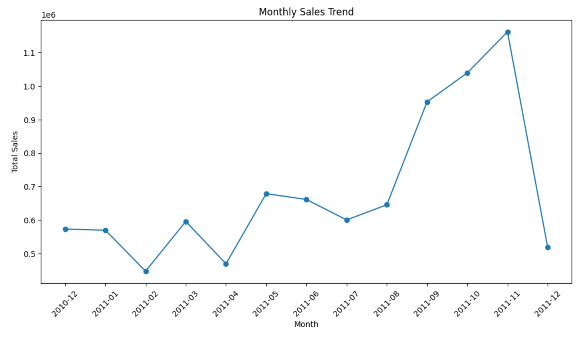
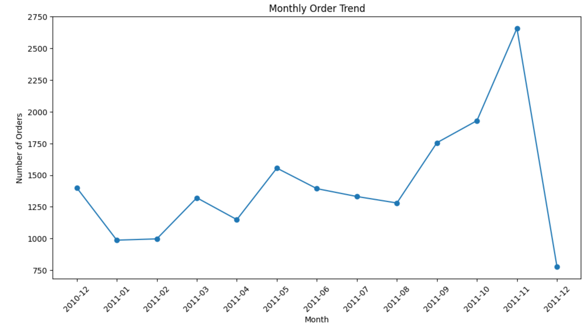
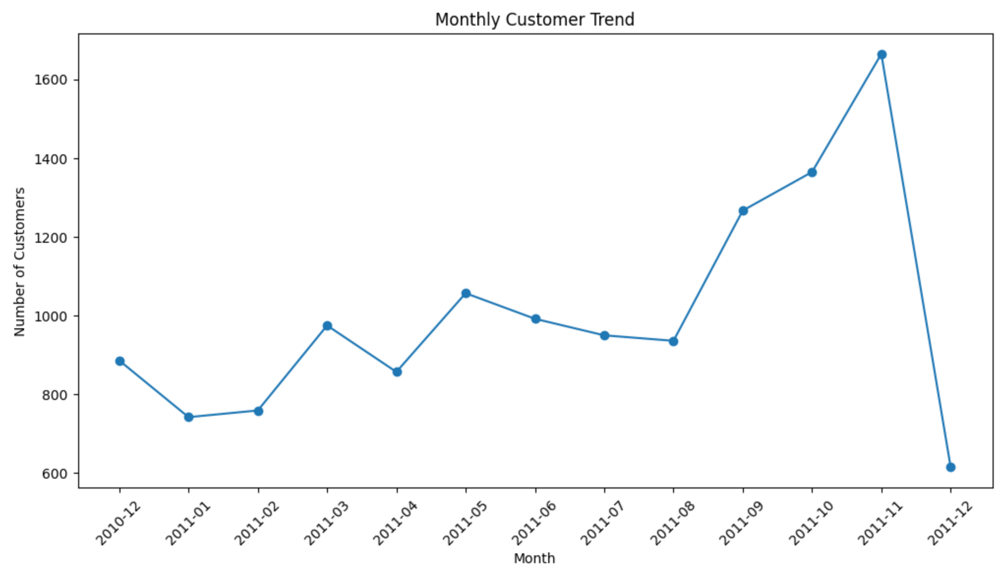
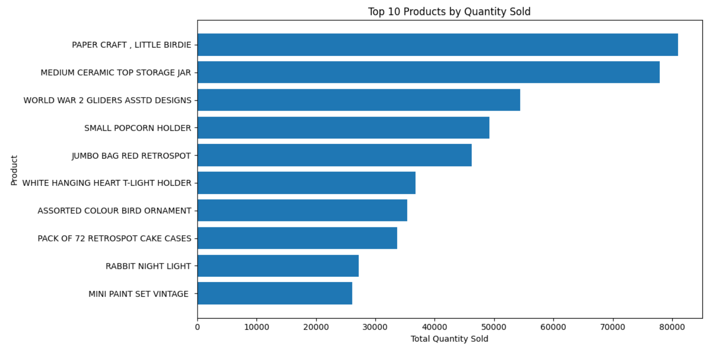
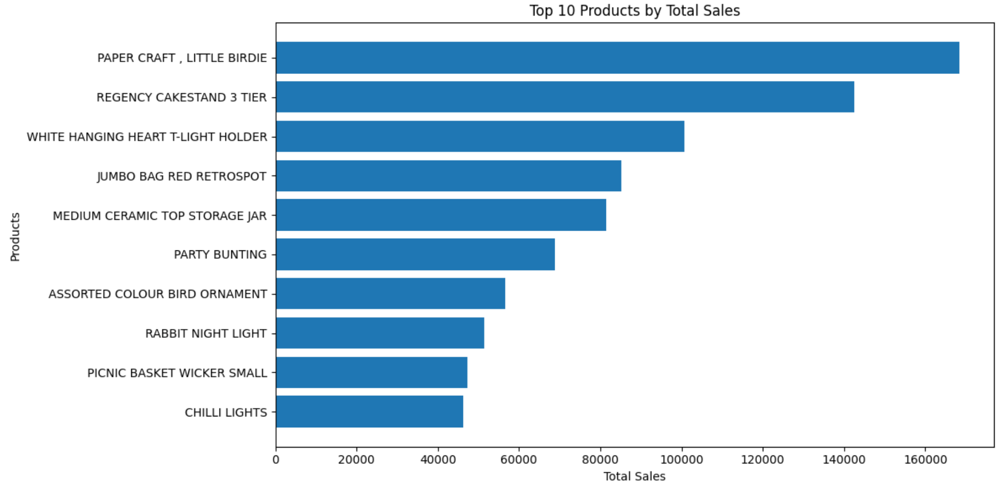
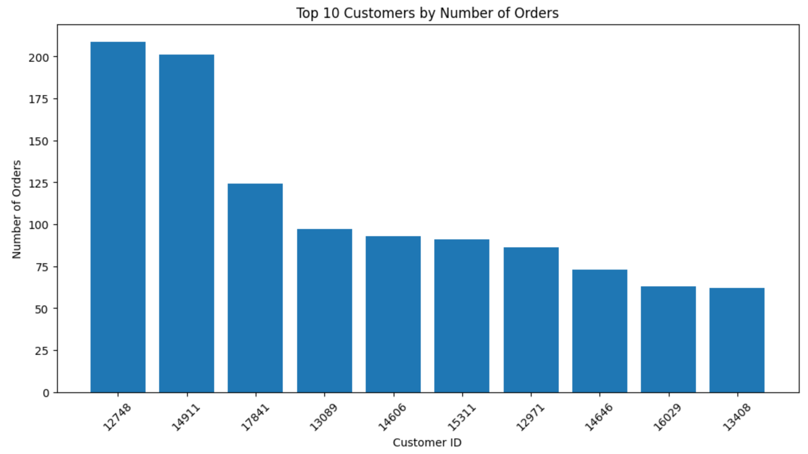
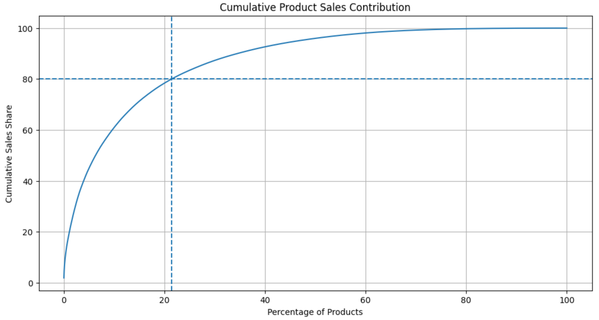
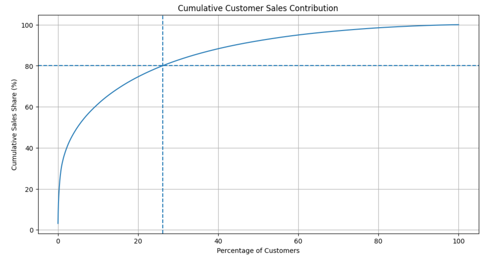

# UK Online Retail Sales Data Analysis

Business-focused sales analysis of the UCI Online Retail dataset, built as a GitHub portfolio project for data analyst internship applications. The project uses Python, pandas, Excel, and data visualization to summarize sales performance, customer activity, monthly trends, and product revenue concentration.

## Project Objective

The goal of this project is to answer practical retail business questions:

- What are the key revenue, order, customer, and product KPIs after cleaning?
- How did sales, order volume, and active customer activity change over time?
- Which products contributed the most revenue and quantity sold?
- How concentrated is revenue among top products and customers?
- What business actions should the retailer prioritize based on the analysis?

This project is intentionally focused on business data analysis, not machine learning.

## Dataset

Source: [UCI Machine Learning Repository - Online Retail](https://archive.ics.uci.edu/dataset/352/online%2Bretail)

The dataset contains transaction records from a UK-based online retailer between December 2010 and December 2011. Local raw and cleaned Excel files are not included in the GitHub repository. To reproduce the analysis, download the dataset from UCI and place the local file at:

```text
data/online_retail.xlsx
```

## Tools

- Python
- pandas
- matplotlib
- openpyxl
- Jupyter Notebook
- Microsoft Excel

## Repository Structure

```text
.
├── README.md
├── requirements.txt
├── notebooks/
│   └── 01_data_loading.ipynb
├── images/
│   ├── monthly_sales_trend.png
│   ├── monthly_order_trend.png
│   ├── monthly_customer_trend.png
│   ├── top_10_products_by_quantity_sold.png
│   ├── top_10_products_by_total_sales.png
│   ├── top_10_customers_by_number_of_orders.png
│   ├── cumulative_product_sales_contribution.png
│   └── cumulative_customer_sales_contribution.png
├── report/
│   └── UK_Online_Retail_Report.docx
└── docs/
    └── project_summary.md
```

## Key Results

- Raw dataset size: 541,909 transaction rows
- Cleaned dataset size: 397,884 valid transaction records
- Total revenue: approximately £8.91M
- Total orders: 18,532
- Total customers: 4,338
- Total products: 3,665
- Sales increased significantly from September to November 2011 and peaked in November 2011
- Growth was mainly driven by increased order volume and active customer activity
- Using StockCode as the product identifier, the top 20% of products contributed 78.65% of total revenue.

## Visualizations

### Monthly Sales Trend



### Monthly Order Trend



### Monthly Customer Trend



### Top Products by Quantity Sold



### Top Products by Total Sales



### Top Customers by Number of Orders



### Product Revenue Concentration



### Customer Revenue Concentration



## Business Recommendations

- Prepare inventory, logistics, and marketing campaigns before the September to November peak season.
- Prioritize stock availability for high-revenue products because revenue is concentrated among a smaller group of products.
- Use high-volume, low-price products to support traffic, bundle offers, and repeat purchases.
- Monitor high-value customers and frequent buyers with retention-focused campaigns.
- Treat December 2011 carefully in trend comparisons because the dataset only includes partial December data.

## How to Run

1. Clone the repository.
2. Download the Online Retail dataset from UCI.
3. Place the Excel file at `data/online_retail.xlsx`.
4. Install dependencies:

```bash
pip install -r requirements.txt
```

5. Open and run the notebook:

```bash
jupyter lab notebooks/01_data_loading.ipynb
```

Running the notebook recreates the local Excel dashboard output under `output/`.

## Limitations

- Canceled orders, returns, missing-customer transactions, and non-positive-price records are excluded from the cleaned sales analysis.
- December 2011 is a partial month and should not be compared directly with full months.
- Product contribution was calculated using StockCode as the product identifier. Results may vary slightly if products are grouped by Description or by StockCode-Description pairs.
- This project does not include predictive models; it is scoped to descriptive business analysis.
